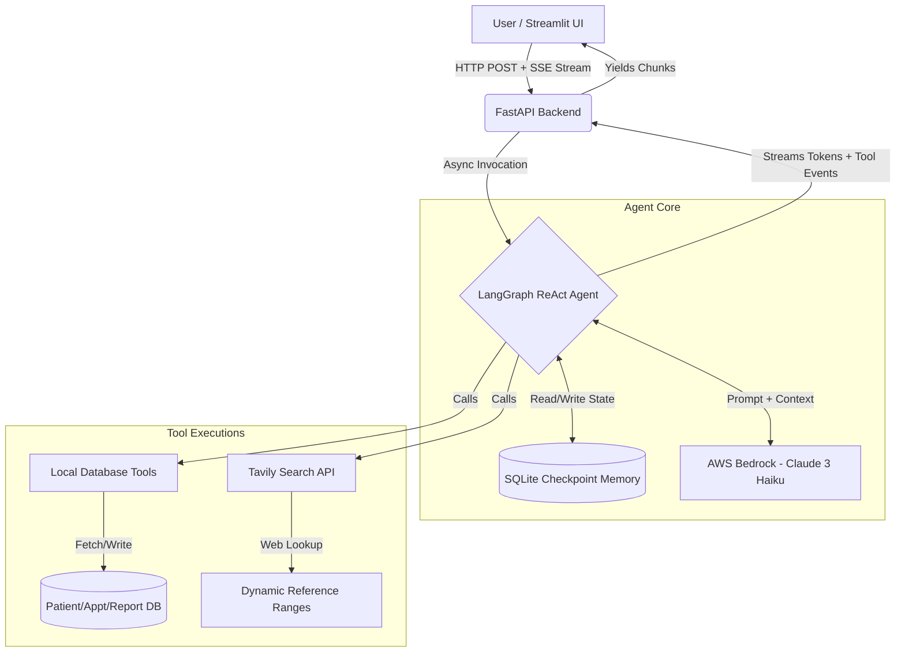

# Healthians AI Assistant

An intelligent, context-aware healthcare AI assistant tailored specifically for **Healthians**, India's leading at-home diagnostics provider. It handles conversational requests for booking home sample collections, explaining lab reports, querying past results, answering health FAQs, and escalating medical emergencies to human doctors.

---

## 🛠️ Setup & Installation

Follow these steps to run the project locally for evaluation:

### 1. Environment Setup
Ensure you have **Python 3.11+** installed. Create and activate a virtual environment:
```bash
python -m venv venv
# On Windows
venv\Scripts\activate
# On Mac/Linux
source venv/bin/activate
```

### 2. Install Dependencies
```bash
pip install -r requirements.txt
```

### 3. Environment Variables
Create a `.env` file in the root directory and add your AWS credentials for Amazon Bedrock (Claude):
```env
AWS_ACCESS_KEY_ID=your_access_key
AWS_SECRET_ACCESS_KEY=your_secret_key
AWS_REGION=us-east-1
MODEL_NAME=anthropic.claude-3-haiku-20240307-v1:0
```
*(Refer to `env.example` if needed).*

### 4. Run the Backend (FastAPI)
Start the backend server in one terminal. This will automatically initialize the SQLite database and seed it with synthetic data.
```bash
uvicorn main:app --reload --port 8000
```

### 5. Run the Frontend (Streamlit)
Open a new terminal, activate the virtual environment, and start the Streamlit UI:
```bash
streamlit run streamlit_app.py
```
The app will open automatically in your browser at `http://localhost:8501`.


---

## 🏗️ Full Agent Architecture

This application employs a decoupled, highly-scalable design separating the chat UI from the LangGraph inference engine, powered by FastAPI streaming.



### Component Breakdown

1. **Frontend (Streamlit)**:
   - Provides a modern ChatGPT-style conversational interface.
   - Parses the Server-Sent Events (SSE) from the backend to render real-time token streaming natively to the DOM.
   - Renders interactive custom status badges (like 📅 Booking, 📋 Reports, 🚨 Escalation) dynamically as tools are executed by the backend.

2. **Backend (FastAPI)**:
   - Exposes asynchronous RESTful endpoints (e.g., `/chat`).
   - Uses Python `async` generators to stream chunks from the LangGraph execution back to the client via HTTP streaming.
   - Completely decouples the UI from the heavy LLM and state-management logic.

3. **Agent Core (LangGraph + LangChain)**:
   - **Agent Engine**: Utilizes `create_react_agent` which implements the ReAct (Reasoning and Acting) paradigm. The LLM can think, decide to call a tool, observe the tool's output, and generate a final response in a continuous loop.
   - **LLM Engine**: Uses AWS Bedrock (`ChatBedrockConverse`) serving Anthropic's Claude 3 Haiku for blazing fast, highly intelligent intent routing and conversational generation.
   - **Persistent Memory**: Uses `langgraph-checkpoint-sqlite` (`AsyncSqliteSaver`) to natively store the full conversation state, maintaining deep contextual memory across continuous conversation turns.
   - **Dynamic Context Injection**: The agent dynamically injects the server's real-time clock (`datetime.now()`) into the system prompt to accurately resolve relative temporal dates (like "tomorrow" or "next week") during the booking process.

4. **Tools / Integrations**:
   - Strongly-typed asynchronous Python tools equipped with robust docstrings help Claude accurately infer expected schemas.
   - **SQLAlchemy Async DB**: Handles the retrieval of mock packages, patient data, previous diagnostic reports, FAQs, and ticket logging for emergency escalations.
   - **Tavily Search API**: Replaced static, hardcoded database tables for medical reference ranges. The `explain_report` tool dynamically queries the web using `langchain-tavily` to fetch accurate, up-to-date clinical reference ranges (e.g., "Normal HbA1c levels") on the fly!
   - **Synthetic Data**: I assumed a standard diagnostic center database architecture and designed a schema that automatically seeds the database with mock records upon startup.

---

## 🚀 Tech Stack

- **Python 3.11**
- **LLM Framework**: LangChain, LangGraph (`langgraph`, `langgraph-checkpoint-sqlite`)
- **Model Provider**: AWS Bedrock (`langchain-aws`)
- **Backend API**: FastAPI, Uvicorn, Pydantic
- **Frontend**: Streamlit (`streamlit`)
- **Database**: SQLite, SQLAlchemy, aiosqlite
- **Testing**: PyTest, PyTest-Asyncio

---

## 🛡️ Handled Edge Cases & Guardrails

During the development and testing phase, I successfully built coverage for multiple edge cases to ensure the AI behaves safely and correctly:

1. **Off-Topic Code Generation (Prompt Bleed)**
   - *Scenario*: User asks the AI to act as an expert coder and write a Python script (e.g., Fibonacci sequence).
   - *Resolution*: Implemented a strict negative constraint in the System Prompt: *"You are a specialized healthcare assistant. If a user asks you to write code... you MUST politely decline."* The agent correctly blocks these requests now.

2. **Service Area Restrictions**
   - *Scenario*: User tries to book a home sample collection in a city where Healthians doesn't operate (e.g., Dehradun).
   - *Resolution*: The `book_appointment` tool identifies the unsupported city and instructs the agent to inform the user gracefully, listing supported cities (Delhi, Gurgaon, Mumbai, etc.) instead of hard-failing.

3. **Empty / Non-Existent Reports**
   - *Scenario*: User asks for previous reports, but they are a new user with no history attached to their phone number.
   - *Resolution*: The `fetch_reports` tool returns a structured "no reports found" JSON, prompting the agent to inform the user nicely and pivot to offering a new health package booking.

4. **Missing Booking Information**
   - *Scenario*: User says "book a test for sugar name is Nikhil" without specifying the city or date.
   - *Resolution*: The ReAct loop detects that the required parameters for `book_appointment` are missing. Instead of calling the tool and failing, it halts and asks the user: *"Could you please share the city and your preferred date?"*

5. **Medical Emergencies & Priority Escalations**
   - *Scenario*: User says "I have an emergency I need a doctor" or "fever".
   - *Resolution*: The `escalate_to_doctor` tool registers an escalation ticket. The agent instructs the user to call 112 (emergency services) or wait for a callback depending on the detected severity.

6. **Persistent Memory State Bleed During Testing**
   - *Scenario*: The `AsyncSqliteSaver` persists context so well that running identical PyTest assertions consecutively caused the LLM to skip tool-calls (saying "Your appointment is *already* confirmed").
   - *Resolution*: Automated integration tests in `test_agent.py` append unique `uuid.uuid4()` strings to test session IDs, ensuring a clean memory slate for every test run.

---

## 🔮 Future Improvements

While this is a robust assignment build, the following enhancements could be added for a production release:

1. **User Authentication**: Integrating OTP-based login (e.g., Firebase Auth) so the agent securely knows the user's phone number and identity without asking.
2. **PostgreSQL Migration**: Swapping SQLite for PostgreSQL (`AsyncPostgresSaver`) to handle high-concurrency connections and persistent storage in a distributed server environment.
3. **Production Deployment**: Containerizing the application using Docker and deploying it to a cloud server (AWS/GCP) behind a production-grade reverse proxy like Nginx.
